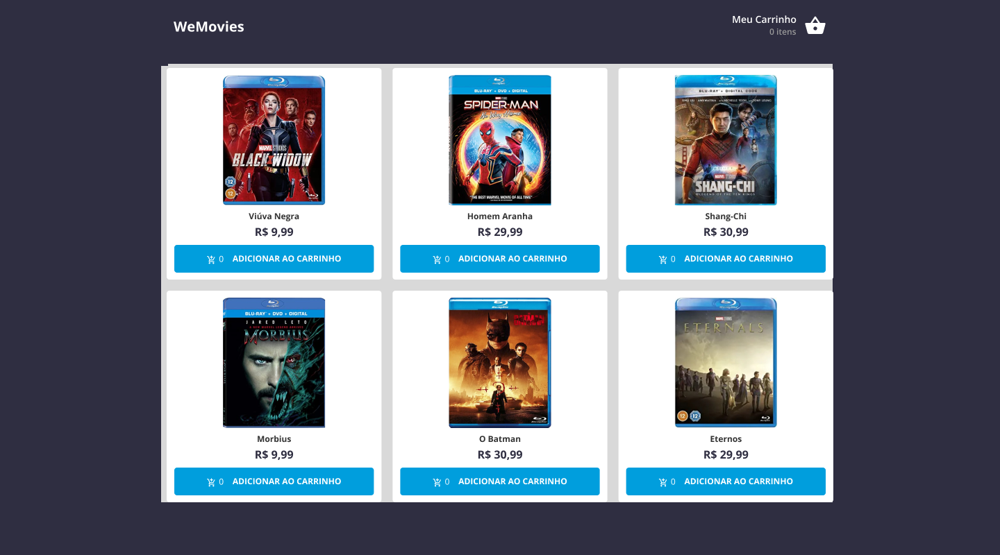

## 💻 Sobre o projeto

Um mini ecommerce feito em React, Typescript e Styled Components para o teste técnico da vaga de "Desenvolvedor React Pleno" para a empresa WeFit.

<div align="center">
    
</div>

<br>

## 🧪 Tecnologias usadas

Esse projeto foi desenvolvido com as seguintes tecnologias:

- [React](https://reactjs.org)
- [TypeScript](https://www.typescriptlang.org/)
- [Vite](https://vitejs.dev)
- [Styled Components](https://styled-components.com)

## 🔗 Clone a aplicação

Clone o projeto e acesse a pasta do mesmo.

```bash
$ git clone https://github.com/limaCoder/wemovies
$ cd wemovies
```

## 🚀 Como iniciar a aplicação

Para iniciá-lo, siga os passos abaixo:

```bash
# Instalando dependências:
$ yarn
# Rodando em modo de desenvolvimento:
$ yarn dev
# Rodando o servidor simulado do json-server:
$ yarn server
```

O app estará disponível no seu browser pelo endereço http://localhost:5173 assim que iniciado.

## 🌐 Live preview

Sem live preview no momento.
